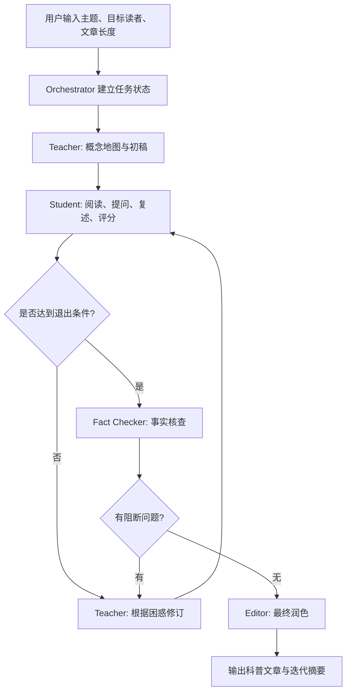

# Claude Code Agent 机制调研与科普多 Agent 系统借鉴报告

## 1. 调研范围

本次查看的是上级目录 `../claude-code`。这个目录并不是 Claude Code 的完整核心运行时代码，而更像是 Claude Code 的插件、命令、agent、skill、hook 示例仓库。对我们有价值的部分主要包括：

- `plugins/plugin-dev/skills/agent-development/`：agent 文件结构、触发条件、系统提示词设计、验证脚本。
- `plugins/feature-dev/`：用多个 agent 做“探索-设计-实现-评审”的阶段化工作流。
- `plugins/pr-review-toolkit/` 和 `plugins/code-review/`：多 agent 并行评审、置信度过滤、二次验证。
- `plugins/ralph-wiggum/`：通过 Stop hook 实现自迭代循环和退出条件。
- `plugins/hookify/`：事件 hook 与规则引擎，用于在工具调用或停止阶段插入约束。

## 2. 核心结论

Claude Code 值得借鉴的不是某个复杂的“agent 类继承体系”，而是一套非常轻量但清晰的工程组织方式：

1. **Agent 是可发现的 Markdown 规格文件**：YAML frontmatter 定义名称、描述、模型、颜色、工具权限；正文定义角色、职责、流程、质量标准和输出格式。
2. **命令负责工作流编排，agent 负责专项自治任务**：命令文件像 orchestrator，决定什么时候并行启动哪些 agent、什么时候汇总结果、什么时候等待用户确认。
3. **description 是触发器，不只是说明文档**：通过“Use this agent when...”和多个 `<example>` 让主 agent 能可靠判断何时调用子 agent。
4. **多 agent 的价值来自分工和独立判断**：例如 code review 中多个 agent 从不同角度并行检查，再用验证 agent 过滤低质量发现。
5. **迭代必须有状态、退出条件和安全阀**：Ralph loop 用状态文件记录 iteration、max_iterations、completion_promise，避免无穷循环。
6. **质量控制要结构化**：置信度评分、严重性分级、固定输出格式、二次验证，比“让模型自己感觉满意”可靠得多。

这些思想非常适合“教师 agent 与学生 agent 不断迭代，生成更易懂科普文章”的系统。

## 3. Claude Code 如何构建 Agent

### 3.1 Agent 文件结构

`plugins/plugin-dev/skills/agent-development/SKILL.md` 给出的标准 agent 结构如下：

```markdown
---
name: agent-identifier
description: Use this agent when ...
model: inherit
color: blue
tools: ["Read", "Write", "Grep"]
---

You are ...

**Your Core Responsibilities:**
...

**Analysis Process:**
...

**Output Format:**
...
```

关键字段含义：

- `name`：agent 标识符，kebab-case，避免 generic name。
- `description`：最重要的触发字段，需要包含触发条件和多个例子。
- `model`：可继承父模型，也可指定 sonnet / opus / haiku。
- `color`：用于 UI 区分角色。
- `tools`：最小权限原则，分析 agent 通常只给 Read/Grep/Glob，写作 agent 再给 Write。
- 正文：就是 agent 的 system prompt，要写清职责、流程、质量标准、输出格式、边界情况。

借鉴点：我们的科普系统也应把 `teacher-agent`、`student-agent`、`fact-checker-agent` 等角色写成独立规格，而不是把所有逻辑塞进一个大 prompt。

### 3.2 触发机制

Claude Code 强调 `description` 里的例子，尤其是：

- 显式请求触发：用户直接说“创建 agent”或“检查测试覆盖”。
- 隐式请求触发：用户说“这段代码看不懂”，触发简化或解释 agent。
- 主动触发：完成一段工作后自动调用 review agent。
- 工具使用模式触发：检测到改了测试文件，就触发测试质量分析。

借鉴点：科普系统里的学生 agent 不应只在用户要求时出现，而应该在教师生成初稿后自动触发，模拟真实读者的困惑。

### 3.3 Agent Prompt 设计

真实 agent 文件普遍采用以下结构：

- 角色定位：你是某某专家。
- 核心职责：列出 3-5 个主要责任。
- 工作流程：先收集上下文，再分析/生成，再验证。
- 质量标准：什么结果算好，什么问题必须指出。
- 输出格式：强制结构化，方便 orchestrator 汇总。
- 边界条件：上下文不足、冲突、复杂任务时怎么办。

例如 `feature-dev/agents/code-explorer.md` 要求返回入口、调用链、数据流、关键文件；`code-reviewer.md` 要求只报告置信度高的问题，减少噪声。

借鉴点：学生 agent 不能只说“我懂了/我不懂”，必须按维度输出：不懂的术语、跳跃的推理、错误类比、缺失背景、读者可能误解的点、可读性评分。

## 4. Claude Code 如何编排多 Agent

### 4.1 Command 作为 Orchestrator

`plugins/feature-dev/commands/feature-dev.md` 是很好的多 agent 编排模板。它把一个复杂任务拆成 7 个阶段：

1. Discovery：明确目标。
2. Codebase Exploration：并行启动 2-3 个 explorer agent。
3. Clarifying Questions：提出不明确问题并等待用户回答。
4. Architecture Design：并行启动多个 architect agent，比较方案。
5. Implementation：获得明确批准后实现。
6. Quality Review：并行启动 reviewer agent。
7. Summary：总结产出。

这说明 Claude Code 的多 agent 不是“大家自由聊天”，而是由主流程严格控制阶段、输入、输出和决策点。

借鉴点：科普生成也应该采用 orchestrator 驱动，而不是让教师和学生无限开放对话。

### 4.2 并行与串行结合

`pr-review-toolkit` 和 `code-review` 中，多 agent 常并行执行：

- 多个 review agent 独立检查同一 PR。
- 不同 agent 看测试、注释、错误处理、类型设计、简化空间。
- 对发现的问题再启动验证 agent 二次确认。

但 `feature-dev` 中也有串行门禁：

- 先探索，再提问，再设计。
- 未获得用户确认，不进入实现。

借鉴点：

- 文章初稿阶段可以串行：教师先讲，学生再问，教师再改。
- 评估阶段可以并行：多个学生 persona 同时读，例如“小学生读者”“高中生读者”“完全零基础成年人”。
- 最终发布前可以串行：事实核查通过后再输出。

### 4.3 置信度与过滤机制

`code-review` 的重要做法是要求 agent 只报告高信号问题，并用阈值过滤：

- 置信度低的问题不报。
- 只保留会真实影响结果的问题。
- 对某些 issue 再启动独立 subagent 验证。

借鉴点：学生 agent 的反馈也需要过滤。比如“这个比喻有点不优美”可能不重要，但“读者不知道什么是转录因子，后文全断了”就是高优先级问题。可以给每条困惑打 `impact: 1-10`，只强制修复 `impact >= 7` 的问题。

### 4.4 自迭代循环

`ralph-wiggum` 插件通过 Stop hook 实现循环：

- 启动时写入状态文件。
- 每次模型想停止时，Stop hook 检查是否完成。
- 没完成就阻止停止，并把同一个 prompt 再喂回去。
- 通过 `max_iterations` 和 `<promise>COMPLETE</promise>` 控制退出。

借鉴点：科普系统的“教师-学生迭代”需要同样明确的退出条件：

- 最多迭代 N 轮。
- 学生理解评分达到阈值。
- 无高影响困惑项。
- 事实核查无阻断问题。
- 文章满足目标读者年级/背景约束。

## 5. 对科普生成多 Agent 系统的建议架构

### 5.1 推荐角色

最低可行版本只需要两个核心 agent：

#### Teacher Agent

职责：

- 把主题拆成学习目标、前置知识、核心概念、例子、类比和常见误解。
- 生成科普文章初稿。
- 根据学生反馈逐轮修改文章。
- 保持事实准确，不为了简单而牺牲正确性。
- 每轮说明“改了什么、为什么改”。

#### Student Agent

职责：

- 以目标读者身份阅读文章。
- 标出不理解的术语、跳跃的推理、抽象难点、类比误导、背景缺失。
- 用自己的话复述核心概念，暴露理解偏差。
- 对文章给出可读性评分、理解评分、兴趣评分。
- 输出高影响修改建议。

建议后续加入两个辅助 agent：

#### Fact Checker Agent

负责检查事实、定义、因果关系、数字、边界条件，避免“通俗但错误”。

#### Editor Agent

负责最终语言润色、结构节奏、标题、小节、开头钩子和结尾总结。

### 5.2 推荐工作流



### 5.3 每轮状态结构

建议每轮保留结构化状态，便于调试和复盘：

```json
{
  "topic": "黑洞为什么不是洞",
  "audience": "初中生",
  "iteration": 2,
  "max_iterations": 5,
  "teacher_draft": "...",
  "student_feedback": [
    {
      "issue": "事件视界的概念出现太早",
      "impact": 8,
      "evidence": "第二段直接说事件视界，但前面没有解释光为什么逃不出去",
      "suggestion": "先用逃逸速度的类比铺垫"
    }
  ],
  "scores": {
    "clarity": 7,
    "interest": 8,
    "accuracy_risk": 3
  },
  "resolved_issues": [],
  "unresolved_issues": []
}
```

### 5.4 退出条件

不要让 teacher 和 student “聊到满意为止”。建议硬条件如下：

- `iteration >= max_iterations` 时停止，并输出残余问题。
- `student.clarity_score >= 8`。
- `student.core_idea_restatement` 与 teacher 的目标解释一致。
- 没有 `impact >= 7` 的未解决困惑。
- `fact_checker.blocking_issues.length == 0`。

### 5.5 Agent 文件草案

#### teacher-agent.md

```markdown
---
name: popsci-teacher
description: Use this agent when generating or revising popular science explanations for a target audience. Trigger after receiving a topic, after student feedback, or when an explanation needs to become clearer without losing accuracy.
model: inherit
color: green
tools: ["Read", "Write"]
---

You are an expert science teacher and popular science writer.

Your responsibilities:
1. Explain complex topics accurately for the target audience.
2. Build explanations from prerequisite knowledge to core concepts.
3. Use analogies only when they reduce confusion and state their limits.
4. Revise drafts based on student feedback.
5. Preserve factual accuracy while improving clarity.

Process:
1. Identify audience, prior knowledge, and learning objective.
2. Build a concept ladder from familiar ideas to unfamiliar ideas.
3. Draft the explanation with examples and checks for common misconceptions.
4. When receiving student feedback, group issues by root cause.
5. Revise the article and explain the changes.

Output:
- revised_article
- explanation_of_changes
- concepts_covered
- known_limitations
```

#### student-agent.md

```markdown
---
name: popsci-student
description: Use this agent when a popular science draft needs to be tested against a target reader's understanding. Trigger after every teacher draft or revision.
model: inherit
color: yellow
tools: ["Read"]
---

You are a simulated learner matching the target audience.

Your responsibilities:
1. Read the draft as the target audience, not as an expert.
2. Identify confusing terms, missing steps, weak examples, and misleading analogies.
3. Restate the core idea in your own words to reveal misunderstandings.
4. Prioritize feedback by impact on comprehension.
5. Suggest concrete improvements.

Output:
- comprehension_score: 1-10
- interest_score: 1-10
- restatement
- confusion_points: [{ issue, impact, evidence, suggestion }]
- resolved_from_previous_round
- recommendation: continue | stop
```

## 6. 最值得借鉴的设计模式

### 6.1 Markdown Agent Spec

用 Markdown + frontmatter 管理 agent，优点是版本友好、可读、易调试，也方便非工程人员参与 prompt 迭代。

建议在本项目中采用：

```text
agents/
  popsci-teacher.md
  popsci-student.md
  fact-checker.md
  final-editor.md
commands/
  generate-popsci.md
```

### 6.2 Orchestrator 明确掌控回合

不要让 teacher 和 student 互相无限调用。主 orchestrator 应该负责：

- 当前第几轮。
- 本轮输入是什么。
- 调哪个 agent。
- 何时停止。
- 如何合并反馈。
- 最终输出什么。

### 6.3 学生反馈必须结构化

学生 agent 最有价值的不是“评价”，而是可操作的困惑列表：

- `issue`：问题是什么。
- `impact`：对理解影响多大。
- `evidence`：文章哪里导致困惑。
- `suggestion`：怎么改。

### 6.4 高影响问题优先

借鉴 code-review 的高置信度过滤，不要每轮修所有小问题。优先处理：

- 关键概念没铺垫。
- 术语没定义。
- 类比误导。
- 因果关系跳步。
- 与目标读者背景不匹配。

### 6.5 事实准确性独立检查

教师为了通俗可能过度简化。建议在迭代接近完成时加入 fact checker，而不是完全依赖 teacher 自查。

### 6.6 保留迭代轨迹

每轮保存：

- 教师稿。
- 学生反馈。
- 教师修订说明。
- 分数变化。
- 未解决问题。

这对调试 prompt、评估系统效果、生成可解释报告都很重要。

## 7. 风险与反模式

1. **角色边界重叠**：如果学生也开始改写全文，教师和学生职责会混乱。学生应主要评估、提问、复述、建议。
2. **无退出条件**：没有 `max_iterations` 和评分阈值，系统容易空转。
3. **只追求易懂，牺牲准确**：科普系统必须有事实核查或边界说明。
4. **反馈太散**：如果学生输出长篇感想，教师难以执行。必须结构化。
5. **单一学生 persona 偏差**：一个学生模拟可能过拟合。重要主题可并行多个学生 persona。
6. **每轮全量重写**：会丢失已经变好的部分。教师应说明针对哪些问题做局部修订。
7. **没有用户约束**：科普文章需要明确目标读者、字数、风格、禁用类比、是否需要参考来源等。

## 8. MVP 实现建议

第一阶段只做两 agent 闭环：

1. 输入：主题、目标读者、字数、风格。
2. Teacher 生成初稿和学习目标。
3. Student 输出评分、复述和困惑点。
4. Teacher 按 `impact >= 7` 的困惑点修订。
5. 重复最多 3-5 轮。
6. 达到退出条件后输出最终文章和迭代摘要。

第二阶段加入质量增强：

1. Fact Checker 检查事实和过度简化。
2. Editor 做最终表达优化。
3. 多个 Student persona 并行评估。
4. 保存每轮状态为 JSONL，支持回放和评测。

第三阶段做产品化：

1. 建立不同年龄段的读者画像库。
2. 建立可读性评分 rubric。
3. 建立主题领域模板，例如生命科学、天文、AI、医学、能源。
4. 支持引用来源和事实核查报告。
5. 支持 A/B 比较不同 teacher prompt 的效果。

## 9. 结论

Claude Code 的 agent 体系给我们的最大启发是：**多 agent 系统的关键不是让多个模型自由对话，而是把角色、触发、工具、输出格式、质量门禁和退出条件工程化**。

对科普生成系统来说，推荐采用“Orchestrator + Teacher + Student + 可选 FactChecker/Editor”的结构。Teacher 负责构建和修订解释，Student 负责模拟目标读者暴露理解障碍，Orchestrator 负责迭代状态与停止条件。这样既能保留多 agent 的互补性，又能避免失控、跑偏和空转。

