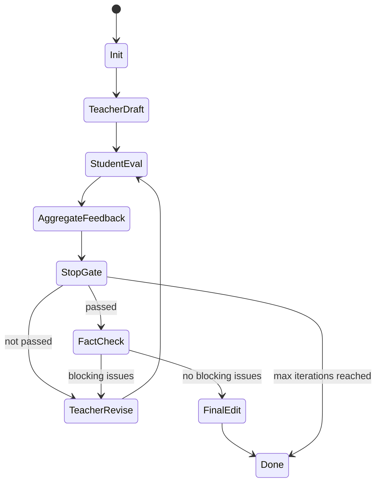

# Claude Code 运行时 Agent 机制调研与科普多 Agent 系统借鉴报告

## 1. 调研说明

本次查看目录为 `/home/zhaoyiming/cc-leak/claude-code/src`。该目录包含更完整的 Claude Code 运行时源码结构。由于来源标注为泄露版本，本报告只做高层架构和工程模式分析，不复制、不复刻其中的具体实现代码。

相比上次查看的 `../claude-code` 插件仓库，这个目录揭示了更底层的机制：

- `query.ts` / `QueryEngine.ts`：主会话循环、工具调用循环、自动压缩、Stop hook、maxTurns。
- `tools/AgentTool/`：子 agent 的定义加载、工具池隔离、同步/异步执行、fork、worktree 隔离、后台通知。
- `tasks/` 和 `Task.ts`：后台任务抽象、任务状态、输出文件、通知机制。
- `constants/prompts.ts`：系统提示词动态组装、工具说明、agent 使用规则、上下文缓存稳定性。
- `utils/toolResultStorage.ts`、`utils/contextAnalysis.ts`、`services/compact/`：大工具结果落盘、上下文 token 归因、自动压缩。
- `coordinator/`、`utils/swarm/`、`SendMessageTool`：多 worker 协调、消息路由、团队模式。
- `skills/`、`SkillTool`、`ToolSearchTool`：技能延迟发现、技能作为可调用能力、工具搜索。

## 2. 核心发现

完整运行时里，Claude Code 的 agent 系统可以概括为：

> 主循环负责“持续推进”；AgentTool 负责“派生工作线程”；Task 系统负责“持久化和通知”；权限/上下文系统负责“隔离和控成本”。

对你的科普生成系统最有借鉴价值的是这些设计：

1. **Agent 不是简单函数调用，而是独立执行上下文**：每个子 agent 有自己的 system prompt、消息、工具池、权限模式、agentId、transcript、abort controller。
2. **Agent 支持多种运行形态**：同步 agent、后台 agent、fork agent、teammate agent、worktree 隔离 agent。
3. **主循环不靠一次模型回复完成任务**：query loop 会根据工具调用、压缩、Stop hook、maxTurns、token budget 等条件继续或停止。
4. **后台任务通过结构化通知回流**：agent 完成后不是“直接插入对话”，而是以 task notification 进入消息队列，再由主 agent 解释给用户。
5. **工具结果和上下文是一级工程问题**：大输出会落盘，旧 tool result 会被替换，重复文件读取会被统计，压缩是主循环能力。
6. **权限隔离是 agent 可靠性的核心**：子 agent 不继承父会话所有临时权限；异步 agent 不能弹权限 UI 时会自动避免需要交互的工具。
7. **多 agent 协作需要消息路由而不是自由混聊**：SendMessage、mailbox、task queue、team file 构成了明确的通信层。

## 3. AgentTool 的关键设计

### 3.1 输入不是只有 prompt

`AgentTool` 的输入 schema 包含这些概念：

- `description`：短任务描述，用于 UI、日志、通知。
- `prompt`：交给 agent 的具体任务。
- `subagent_type`：选择具体 agent 类型。
- `model`：可选模型覆盖。
- `run_in_background`：后台执行。
- `name` / `team_name`：把 agent 变成可寻址 teammate。
- `mode`：权限模式，例如计划模式。
- `isolation`：隔离运行，例如 worktree。
- `cwd`：指定运行目录。

借鉴点：科普系统里不要只传一段文章给 student agent。每轮应传：

- 任务描述。
- 目标读者画像。
- 本轮文章。
- 上轮未解决问题。
- 评分标准。
- 输出格式。
- 是否后台执行。

### 3.2 Agent 定义字段比插件示例更丰富

运行时解析 agent frontmatter 时支持更多字段：

- `tools` / `disallowedTools`：允许或禁止工具。
- `skills`：预加载技能。
- `mcpServers` / `requiredMcpServers`：agent 依赖的外部能力。
- `hooks`：agent 生命周期内注册 hooks。
- `maxTurns`：限制 agent 自己最多运行多少轮。
- `permissionMode`：覆盖 agent 权限模式。
- `memory`：agent 记忆作用域。
- `background`：默认后台执行。
- `initialPrompt`：启动时预置提示。
- `isolation`：隔离执行。
- `omitClaudeMd`：读-only agent 省略无关上下文来省 token。

借鉴点：我们的 `popsci-student` 可以设置 `maxTurns: 1` 或很小的轮数，因为学生评估不应展开成长对话；`popsci-teacher` 可以有更多轮；`fact-checker` 应有检索工具；`editor` 不需要外部工具。

### 3.3 子 agent 有自己的工具池和权限模式

运行时会为 worker 重新 assemble tool pool，并按 agent 定义过滤工具。异步 agent 的权限提示会更保守，因为它不能像前台 agent 一样实时弹窗。

借鉴点：

- Student agent 默认不应有写入工具，只能读文章并输出反馈。
- Teacher agent 可以写草稿和状态。
- Fact checker 可以访问搜索/文献工具，但不直接改稿。
- Editor 可以改最终稿，但不能改事实核查报告。

### 3.4 Agent 可以 background 化

AgentTool 支持后台执行，结果会写入 output file，并通过 task notification 回到主消息队列。主 agent 不应假装知道后台 agent 的结果，而要等通知。

借鉴点：多学生 persona 最适合后台并行：

- `student-junior`
- `student-highschool`
- `student-adult-beginner`
- `student-skeptic`

Orchestrator 启动它们后等待结构化通知，再合并反馈。不要让教师在学生结果返回前预判“学生应该会觉得哪里不懂”。

### 3.5 Fork agent 的启发

运行时有 fork subagent 概念：子 agent 可以继承父上下文，但输出噪声不进入父上下文，适合研究性任务；同时有明确警告：不要中途偷看 fork 输出，不要预测 fork 结果。

借鉴点：科普系统可以把“多学生读稿”设计成 fork：

- fork 继承主题、读者目标、当前稿件。
- 每个 fork 只输出评估摘要。
- 主 orchestrator 只读取最终结构化结果。
- 避免把学生评估过程中的长篇推理塞回主上下文。

## 4. Query Loop 的关键设计

### 4.1 主循环不是单轮

`query.ts` 的主循环不断执行：

1. 准备消息和系统上下文。
2. 做工具结果预算处理。
3. 进行 microcompact / autocompact / context collapse。
4. 调模型。
5. 如果模型产生 tool_use，执行工具并继续。
6. 如果没有工具调用，进入 Stop hook。
7. Stop hook 可阻止结束并注入新消息。
8. 检查 maxTurns / token budget / abort。

借鉴点：科普生成也应是一个 loop，而不是 `teacher -> student -> teacher` 手写三步。建议抽象成：

```text
while true:
  run next role
  persist turn state
  evaluate stop conditions
  maybe compact history
  maybe spawn background evaluators
  if done: finalize
```

### 4.2 Stop hook 是“结束前门禁”

Claude Code 在模型自然停止后会运行 Stop hook。Hook 可以：

- 放行结束。
- 返回阻断错误，让模型继续处理。
- 阻止 continuation。
- 注入系统摘要。
- 对 teammate 的任务完成状态做检查。

借鉴点：科普系统可设计类似的 `before_finalize` gate：

- 是否还有高影响困惑。
- 学生复述是否正确。
- fact checker 是否有 blocking issues。
- 文章是否符合目标长度和读者级别。
- 是否包含未解释术语。

如果 gate 不通过，继续回到 teacher 修订，而不是直接输出。

### 4.3 maxTurns 和 token budget 是安全阀

运行时支持 `maxTurns`，还会用 token budget 判断是否继续。它还检测“继续几次但 token 增长很小”的收益递减，避免空转。

借鉴点：科普系统要有双重停止：

- 硬停止：`max_iterations`。
- 软停止：理解分数达标、问题减少趋缓、剩余问题影响低。

可以加入“收益递减”判断：

```json
{
  "improvement_delta": {
    "clarity": 0,
    "high_impact_issues": 0
  },
  "diminishing_rounds": 2
}
```

连续两轮无明显改进时停止，输出“残余问题与建议人工处理点”。

## 5. Task 系统的关键设计

### 5.1 任务是持久对象

`Task.ts` 定义任务状态：

- `id`
- `type`
- `status`
- `description`
- `startTime` / `endTime`
- `outputFile`
- `outputOffset`
- `notified`

不同任务包括 local shell、local agent、remote agent、teammate、workflow 等。

借鉴点：每个科普生成 run 应有独立 `run_id`，每个 agent 回合应有 `task_id`：

```text
runs/{run_id}/
  state.json
  drafts/
    iter-1-teacher.md
    iter-2-teacher.md
  feedback/
    iter-1-student-junior.json
    iter-1-student-adult.json
  final.md
  report.md
```

### 5.2 后台 agent 结果通过通知进入主队列

LocalAgentTask 会追踪工具使用数、token 数、最近活动、最终结果，并生成结构化 task notification。通知里包含 task id、status、summary、result、usage、output file。

借鉴点：学生评估应作为结构化事件返回：

```xml
<popsci-eval-notification>
  <agent>student-junior</agent>
  <iteration>2</iteration>
  <status>completed</status>
  <clarity_score>8</clarity_score>
  <high_impact_issue_count>1</high_impact_issue_count>
  <result_path>...</result_path>
</popsci-eval-notification>
```

这样 orchestrator 可以确定哪些结果已回来、哪些失败、是否需要重试。

### 5.3 支持中途追加消息

`SendMessageTool` 和 LocalAgentTask 的 `pendingMessages` 机制允许主 agent 给正在运行的 agent 追加消息。

借鉴点：如果 student agent 反馈过粗，orchestrator 可以追问：

- “只列 impact >= 7 的问题。”
- “请重新按 JSON schema 输出。”
- “请从初中生视角复述，不要专家视角。”

这比重启 agent 更省上下文，也更像真实协作。

## 6. 上下文与成本控制

### 6.1 大工具结果落盘

`toolResultStorage` 的思想是：工具结果太大时，不把全文塞进消息上下文，而是保存到磁盘，只给模型一个预览和路径。

借鉴点：科普系统中这些内容应落盘：

- 多轮草稿全文。
- 多个学生的完整反馈。
- fact checker 的详细证据。
- 参考资料摘要。

主上下文只保留：

- 当前稿。
- 未解决高影响问题。
- 分数变化。
- 必要事实风险。

### 6.2 工具结果按“单条消息总预算”限制

运行时不仅限制单个工具结果，还限制同一 user message 中多个并行工具结果的合计大小，避免 10 个并行结果一起撑爆上下文。

借鉴点：并行多个 student persona 时，不应把全部长反馈直接拼回 teacher。应先聚合：

```json
{
  "common_issues": [],
  "persona_specific_issues": [],
  "must_fix": [],
  "nice_to_have": []
}
```

Teacher 只看聚合后的高影响问题，完整反馈留在文件里。

### 6.3 Context analysis 可解释化

`contextAnalysis` 会统计 human message、assistant message、tool request、tool result、重复 Read 文件等 token 来源。

借鉴点：科普系统可以统计每轮成本：

- teacher tokens
- student tokens
- fact-check tokens
- draft tokens
- feedback tokens
- saved-to-disk tokens

这对后续优化 prompt、控制批量生成成本很重要。

### 6.4 读-only agent 省略无关上下文

Explore/Plan agent 会省略 CLAUDE.md、旧 git 状态等对其任务无关的上下文。

借鉴点：student agent 不需要完整系统历史，只需要：

- 目标读者。
- 当前稿。
- 评分标准。
- 上轮已解决/未解决问题。

不要把 teacher 的全部推理、参考材料、所有旧稿都传给学生。

## 7. Coordinator 与多 Worker 模式

### 7.1 Coordinator 只做编排

`coordinatorMode` 的系统提示把主 agent 定义为 coordinator：

- 帮用户完成目标。
- 指派 worker 研究、实现、验证。
- 合成结果并与用户沟通。
- 不把 worker 结果当用户消息感谢。
- 不用 worker 做琐碎任务。
- 不预测 worker 尚未返回的结果。

借鉴点：科普系统的 orchestrator 不应亲自写全部内容，也不应替学生评估；它应该：

- 管状态。
- 选下一步。
- 合并反馈。
- 决定是否继续。
- 生成最终交付报告。

### 7.2 Worker 能力需要明确暴露

Coordinator 会把 worker 可用工具、MCP server、scratchpad 目录等写入上下文，让主 agent 知道能派什么活。

借鉴点：orchestrator 应知道每个 agent 的能力矩阵：

| Agent | 能力 | 不该做 |
|---|---|---|
| Teacher | 解释、改写、概念搭桥 | 最终事实裁决 |
| Student | 发现困惑、复述、评分 | 改写全文 |
| Fact Checker | 查证、标风险 | 为了通俗牺牲严谨 |
| Editor | 润色、结构、标题 | 改事实 |
| Aggregator | 合并多学生反馈 | 发明新问题 |

### 7.3 Scratchpad 作为跨 worker 知识层

Coordinator 模式里有 scratchpad，用于 worker 共享持久知识。

借鉴点：科普系统可以设置 run 内 scratchpad：

```text
scratchpad/
  concept-map.json
  audience-profile.json
  terminology.json
  unresolved-issues.json
  fact-claims.json
```

这样各 agent 不必反复从长文里提取同一批事实和术语。

## 8. 技能与工具发现

### 8.1 SkillTool 把技能当成可调用能力

SkillTool 可以把一个 skill prompt 放进 forked sub-agent 里执行，避免技能内容全塞进主上下文。

借鉴点：科普系统可以把领域写作方法做成 skill：

- `explain-with-analogy`
- `detect-unstated-prerequisites`
- `simplify-without-lying`
- `age-level-readability`
- `fact-claim-extraction`

Agent 需要时才调用，而不是默认全部加载。

### 8.2 ToolSearch 延迟加载工具

ToolSearchTool 支持按关键词搜索 deferred tools，避免工具描述全部常驻上下文。

借鉴点：未来如果科普系统接入很多外部工具，例如论文搜索、百科、图片生成、知识图谱、可读性分析，不要把所有工具说明都塞进 system prompt。应按任务阶段发现：

- 初稿阶段：写作工具。
- 核查阶段：检索工具。
- 配图阶段：图像工具。
- 发布阶段：导出工具。

## 9. 针对科普系统的推荐运行时设计

### 9.1 建议模块划分

```text
src/
  runtime/
    orchestrator.ts
    loop.ts
    task-store.ts
    notification-queue.ts
    context-budget.ts
  agents/
    definitions/
      teacher.md
      student.md
      fact-checker.md
      editor.md
      aggregator.md
    loader.ts
    runner.ts
  workflows/
    generate-popsci.ts
  state/
    run-state.ts
    iteration-state.ts
  storage/
    drafts.ts
    feedback.ts
    reports.ts
  eval/
    readability.ts
    convergence.ts
    stop-gates.ts
```

### 9.2 推荐状态机



### 9.3 推荐 agent 配置

```yaml
teacher:
  tools: [read_state, write_draft, read_feedback]
  maxTurns: 3
  permissionMode: write-draft-only
  memory: project

student:
  tools: [read_draft]
  maxTurns: 1
  background: true
  omit_history: true

aggregator:
  tools: [read_feedback, write_feedback_summary]
  maxTurns: 1

fact_checker:
  tools: [read_draft, web_search, claim_extractor, write_fact_report]
  maxTurns: 3

editor:
  tools: [read_draft, read_fact_report, write_final]
  maxTurns: 2
```

### 9.4 每轮主上下文只保留摘要

建议主 loop 每轮只保留：

```json
{
  "iteration": 3,
  "current_draft_path": "runs/x/drafts/iter-3.md",
  "draft_summary": "...",
  "top_issues": [
    {
      "issue": "术语 X 未解释",
      "impact": 8,
      "personas": ["junior", "adult-beginner"]
    }
  ],
  "scores": {
    "clarity": 8,
    "interest": 7,
    "accuracy_risk": 2
  },
  "stop_gate": {
    "passed": false,
    "reason": "1 high-impact issue remains"
  }
}
```

完整文章和完整反馈都通过路径读取。

## 10. 可直接借鉴的工程原则

### 10.1 把“角色”与“运行”分离

角色定义在 markdown/json；运行时负责加载、过滤、注入工具、执行、持久化。这样之后新增“儿童读者”“专家审稿人”“短视频脚本编辑”不用改主循环。

### 10.2 默认读写隔离

学生和核查 agent 默认只输出报告，不直接改稿。只有 teacher/editor 能写稿。这样职责清楚，避免多 agent 同时改同一文章导致冲突。

### 10.3 后台并行，但汇总串行

多个学生并行评估；aggregator 串行合并；teacher 串行修订。这是效率和一致性的折中。

### 10.4 输出结构必须机器可读

所有 agent 都应输出 JSON 或带 schema 的结构，至少包括：

- `status`
- `score`
- `issues`
- `blocking`
- `next_action`
- `confidence`

### 10.5 每个 agent 有 maxTurns

Teacher 可以 2-3 turns；Student/Aggregator 一般 1 turn；FactChecker 可 2-3 turns。不要让任何 agent 无限制自我延展。

### 10.6 高成本内容落盘

长文章、长反馈、检索证据全部落盘。主上下文只保留摘要、路径和未解决问题。

### 10.7 不预测后台 agent

Orchestrator 启动学生评估后，在结果回来前只能说“等待评估”，不能推测结论。这个原则能防止系统自嗨。

### 10.8 失败要可恢复

每个 agent task 都有状态和输出路径。失败时可以：

- 重试同一 agent。
- 降级到单学生评估。
- 跳过非阻断 persona。
- 输出部分结果和风险说明。

## 11. MVP 落地建议

第一版不要实现 Claude Code 那么复杂的全能力 runtime，只借鉴最小闭环：

1. Agent definition loader：读取 `agents/*.md`。
2. Agent runner：给 agent 单独 prompt、单独工具、单独 maxTurns。
3. Task store：保存每个 agent 调用的状态、输入、输出。
4. Notification queue：后台 student 完成后回流。
5. Stop gate：判断是否继续迭代。
6. Context budget：长输出落盘，只把摘要传回主循环。

MVP 工作流：

```text
generate(topic, audience):
  state = init_run()
  teacher_draft()
  for i in 1..max_iterations:
    launch students in parallel
    collect notifications
    aggregate feedback
    if stop_gate_passed: break
    teacher_revise()
  fact_check()
  if blocking: teacher_revise once
  final_edit()
  write final report
```

## 12. 和上份报告的关系

上一份 `claude-code-agent-analysis-report.md` 主要从插件仓库总结：

- Markdown agent spec。
- description 触发。
- 多 agent 插件工作流。
- Ralph loop 自迭代。

本报告补充运行时层：

- AgentTool 如何创建独立执行上下文。
- 子 agent 工具池、权限、MCP、skills、hooks 如何隔离。
- 后台 task 如何通知主循环。
- query loop 如何通过压缩、Stop hook、maxTurns 控制生命周期。
- context/token 管理为什么应该成为系统核心模块。

两份报告合起来的结论是：

> 科普多 agent 系统应采用“轻量 agent spec + 强 orchestrator runtime”的组合。不要让 teacher/student 自由互聊，而要让 runtime 明确控制 agent 生命周期、上下文、工具权限、输出结构、迭代停止和失败恢复。

